# ⚡ SporTakip | Compound Athletic

> **Modern, mobil öncelikli (PWA), yüksek performanslı ve rol tabanlı (RBAC) Butik Spor Salonu, Yoklama & Hakediş Otomasyon Platformu.**

<div align="center">
  
  <br><br>
  
  [-512BD4?logo=dotnet&logoColor=white)](https://dotnet.microsoft.com/)
  [](https://www.sqlite.org/)
  [](#)
  [-10B981?logo=checkmarx&logoColor=white)](#)
  [](#)
  [](LICENSE)
</div>

---

## 🌟 Proje Genel Bakış

**SporTakip**, butik stüdyolar ve fonksiyonel fitness salonları (Compound Athletic, CrossFit, Pilates, Boks ve Personal Training merkezleri) için geliştirilmiş bağımsız bir stüdyo işletim sistemidir. 

Ağır ve hantal harici kütüphaneler yerine; **.NET 10 ASP.NET Core Web API**, **Entity Framework Core 10** ve **Vanilla JavaScript (ES Modules) + CSS3** mimarisiyle sıfırdan geliştirilmiştir. Tasarım dilinde **Hevy, Whoop ve Nike Training Club** esintili **Volt Lime (`#CCFF00`) & Obsidian Dark** atletik renk paleti kullanılmıştır.

---

## 🎯 4 Rol Bazlı Ekran Denetimi ve Ekran Görüntüleri

Sistem; **Misafir**, **Atlet / Sporcu**, **Koç / Eğitmen** ve **Salon Sahibi** olmak üzere 4 temel rol üzerinden tam yetki izolasyonu (RBAC) ile çalışır.

---

### 🌐 1. Misafir (Guest / Ziyaretçi) Ekranları

Giriş yapmamış bir ziyaretçinin salon doluluğunu, antrenör programını ve üyeleri görmesi gizlilik duvarıyla engellenir. Misafire genel antrenman şablonları, stüdyo vizyonu ve hızlı iletişim/randevu akışları sunulur.

| Misafir Karşılama & Hero | Kilitli Seans Gizlilik Duvarı | Sürtünmesiz SMS/OTP Çekmecesi |
| :---: | :---: | :---: |
| 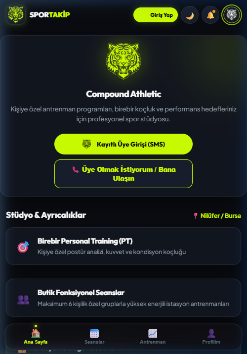 | 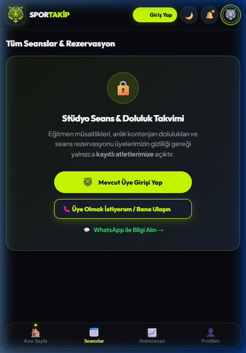 | 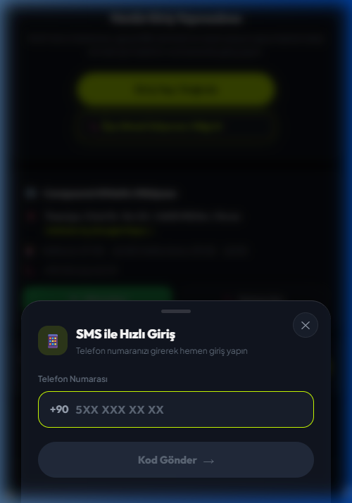 |

* **Hero & Stüdyo Vitrini:** Marka amblemi, antrenman felsefesi ve stüdyo tanıtımı.
* **Gizlilik Koruması:** Seans listesi, saatler ve kontenjanlar kilitlidir. Misafir sadece *"Mevcut Üye Girişi"* veya *"Bize Ulaşın / Bilgi Alın"* aksiyonunu tetikleyebilir.
* **Sürtünmesiz OTP Girişi:** Şifresiz, SMS doğrulama kodu (6 hane) ve 3 dakikalık sayaç ile konforlu giriş çekmecesi.

---

### 🏃‍♂️ 2. Atlet / Sporcu Portalı (Member / Athlete)

Kayıtlı sporcunun kendi antrenman yolculuğunu, kalan ders haklarını ve seans rezervasyonlarını yönettiği PWA mobil portalı.

| Aktif Paket Kartı | 2 Haftalık Seans Takvimi | Canlı İdman & Egzersiz Logger | Profil & Canlı VKİ |
| :---: | :---: | :---: | :---: |
| 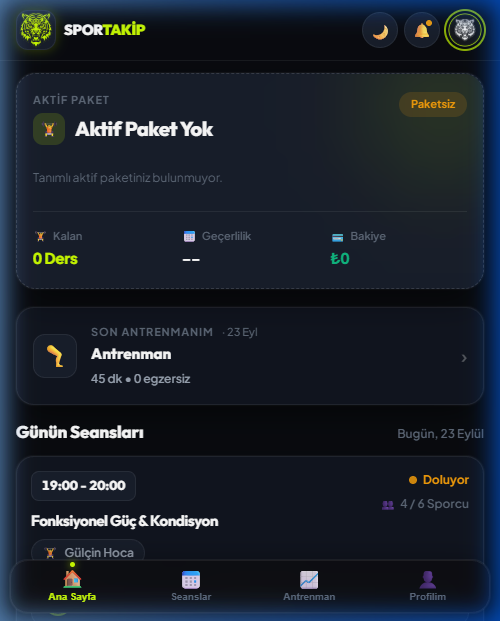 | 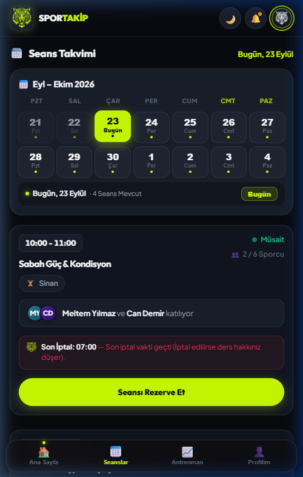 | 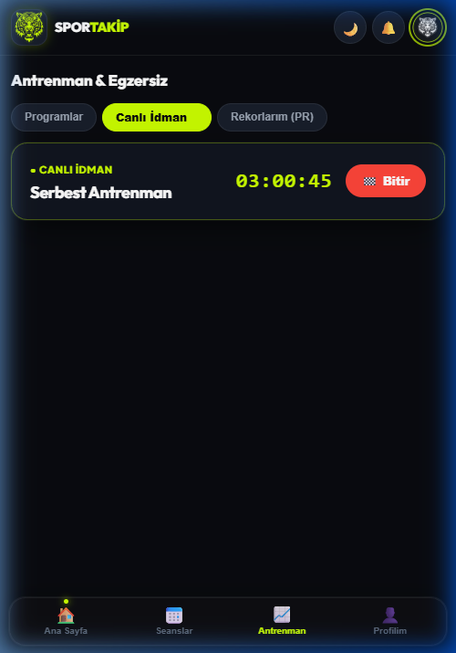 | 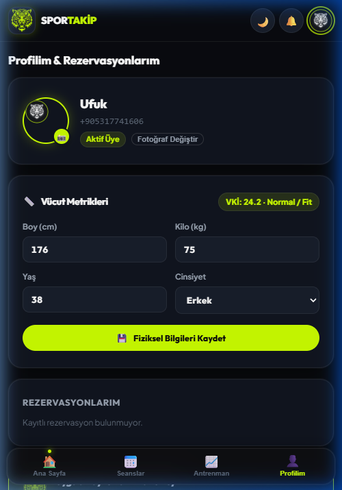 |

* **Segmentli İlerleme Çubuğu:** Tamamlanan ve kalan dersleri Volt haplarıyla gösteren görsel çubuk, kalan ders, son geçerlilik tarihi ve bakiye durumu.
* **2 Haftalık Kesintisiz Takvim:** Bulunduğu hafta ve gelecek hafta olmak üzere 14 günlük interaktif seans gridi.
* **Sosyal Kanıt & Katılımcı Baloncukları:** *"Can D., Meltem Y. ve +1 kişi katılıyor"* rozetleri ve eğitmen atamaları.
* **3 Saat İptal Kuralı:** Seansa 3 saatten az kala yapılan iptallerde ders hakkının yanacağını belirten akıllı geri sayım.
* **Hevy Tarzı Canlı İdman:** Canlı kronometre, set, tekrar ve ağırlık loglama, kişisel rekorlar (1RM PR).
* **Beden Kitle İndeksi (VKİ):** Boy ve kilo güncellendiğinde anlık dinamik hesaplanan fitlik rozeti (*"Fit / Normal"*, *"Fazla Kilolu"* vb.).

---

### 🏋️ 3. Koç / Eğitmen Masası (Coach / Trainer)

Antrenörlerin salonda cep telefonundan 1 saniyede yoklama almasını, saatlik kapasiteyi denetlemesini ve kişisel hak edişini izlemesini sağlar.

| Saatlik Doluluk (7 Günlük Şerit) | Tek Seferlik Kesin Yoklama | İkame Hoca & %40 Kuralı | Kişisel Hakediş Tablosu |
| :---: | :---: | :---: | :---: |
| 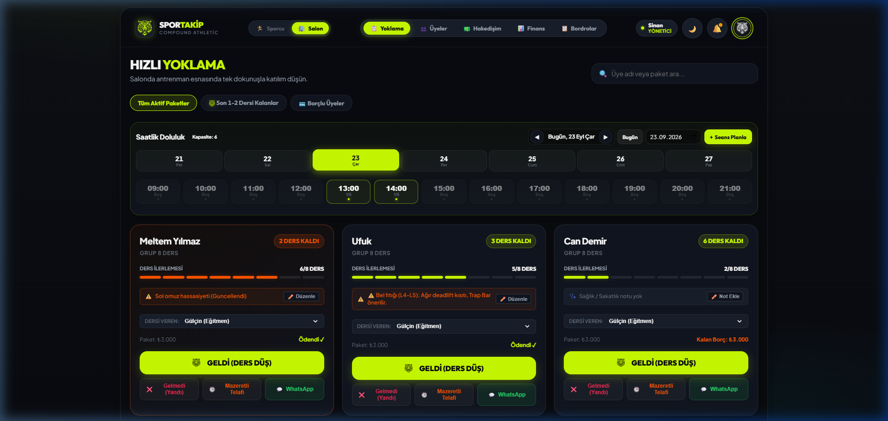 | 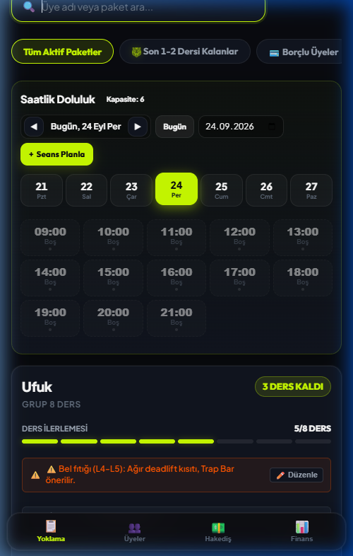 | 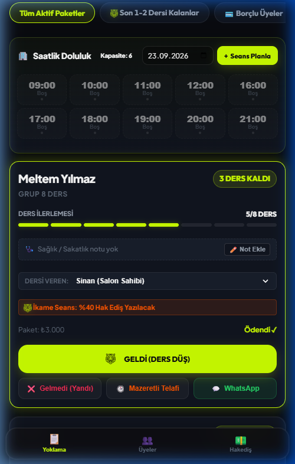 | 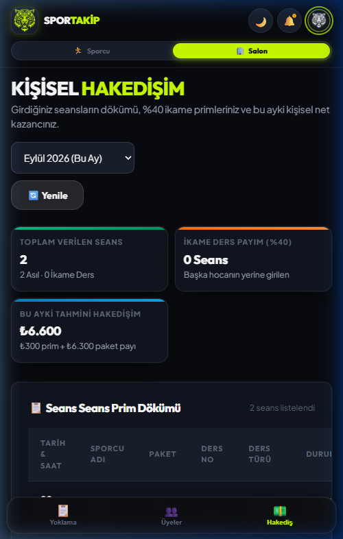 |

* **Hibrit Mod Anahtarı (`[ 🏃 Sporcu | 🏢 Salon ]`):** Koç oturum açtığında tek tıkla kendi idmanları ile salon yönetim masası arasında geçiş yapabilir.
* **Saatlik Doluluk Şeridi (09:00 - 21:00):** Seans Takvimi tasarımıyla bütünleşik 7 günlük interaktif gün şeridi, `◀` / `▶` gün değiştirme ve anlık slot doluluk filtreleme.
* **Kilitli Yoklama ("Geldiyse Gelmiştir"):** Yoklaması alınan sporcu için kart kilitlenir (`✓ BU SEANSTA GELDİ`); çelişkili `Gelmedi` ve `Telafi` butonları gizlenerek veri güvenliği sağlanır.
* **İkame Eğitmen ve %40 Hak Ediş:** Başka bir hocanın üyesine derse girildiğinde otomatik beliren `🦁 İkame Seans: %40 Hak Ediş Yazılacak` rozeti.
* **Finansal Gizlilik (RBAC İzolasyonu):** Koç sadece kendi verdiği derslerin hakedişini görür; salon sahibinin cirosu ve genel kasa koça kesinlikle gösterilmez.

---

### 🏢 4. Salon Sahibi & Yönetici Paneli (Admin / Owner)

Salon sahibine genel ciro, tahsil edilen kasa, hoca bordroları, paket tanımlama ve sporcu düzenleme yetkisi sunan tam yetkili yönetim kokpiti.

| Finans Dashboard (Ciro & Kasa) | Standart Paket Yönetimi | Aylık Eğitmen Bordroları | Atlete Özel Esnek Fiyat |
| :---: | :---: | :---: | :---: |
| 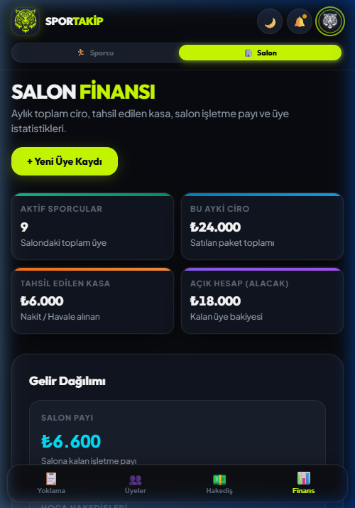 | 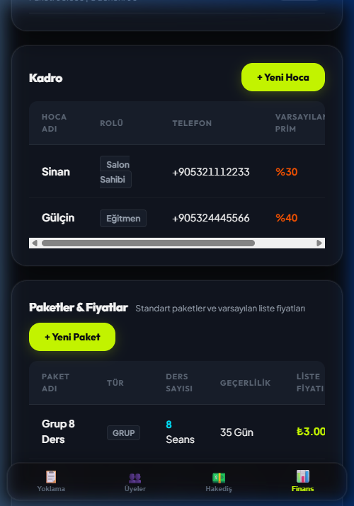 | 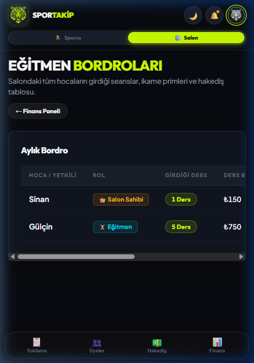 | 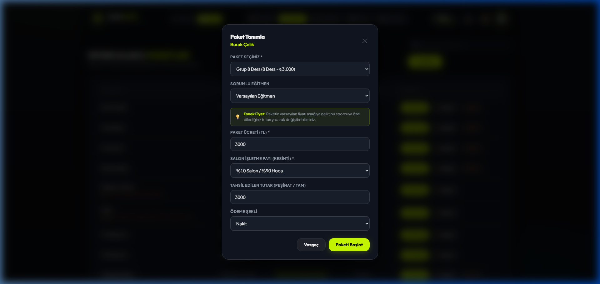 |

* **Finansal KPI Kartları:** Aktif Sporcu Sayısı, Aylık Toplam Ciro, Tahsil Edilen Kasa, Açık Hesap (Alacak Takibi).
* **Gelir Dağılımı:** Salon Payı (%30 - %40 net işletme payı) ve Hoca Hakedişleri toplamı; tek dokunuşla bordro ekranına geçiş.
* **Aylık Eğitmen Bordroları:** Antrenör bazında girilen seanslar, ders başı primler, paket payları ve net hakediş dökümü.
* **Paket & Fiyat Yönetimi (`+ Yeni Paket`):** Salon sahibinin paket adı, seans sayısı, geçerlilik günü ve liste fiyatı tanımlayabilmesi.
* **Atlete Özel Esnek Fiyatlandırma:** Üyeye paket satışı yaparken liste fiyatı otomatik gelir; ancak o sporcuya özel dilediğiniz gibi farklı/indirimli bir fiyat belirlenebilir.
* **Sporcu Düzenleme (`✏️ Düzenle`):** Boy, kilo, yaş, cinsiyet, telefon ve sağlık/sakatlık kısıt notlarının güncellenebilmesi.

---

## 📐 İş Kuralları & Matematiksel Modeller

### 1. Gelir Paylaşımı ve %40 İkame Antrenör Kuralı
$$\text{Ders Başı Birim Ücret} = \frac{\text{Paket Satış Fiyatı}}{\text{Toplam Ders Sayısı}}$$

* **Asıl Eğitmen:** Kendi üyesine ders verdiğinde sözleşmeli prim oranını (örn: `%40`) alır:
  $$\text{Hakediş} = \text{Birim Ücret} \times \text{Prim Oranı}$$
* **İkame Eğitmen:** Bir hoca başka bir hocanın üyesinin dersine girdiğinde, birim seans ücretinin **%40'ı** fiilen derse giren ikame hocaya yazılır; kalan **%60'ı** asıl hocanın hesabında kalır:
  $$\text{İkame Prim} = \text{Birim Ücret} \times 0.40$$

### 2. Saatlik Doluluk ve Kapasite Eşikleri (BR-03)
* 🟢 **0 - 3 Kişi:** **Rahat** (Salonda ideal çalışma alanı)
* 🟡 **4 - 5 Kişi:** **Doluyor** (Yeni seans eklerken dikkatli olunmalı)
* 🔴 **6+ Kişi:** **Kritik Dolu / Kapasite Aşımı** (Yeni kayıt uyarısı)

### 3. Son 3 Saat İptal Kuralı (No-Show Cezası)
* Seans saatine **3 saatten fazla** varken yapılan iptallerde ders hakkı sporcuya iade edilir (`Excused / Telafi`).
* **3 saatten az** kala haber verilen veya habersiz gelinmeyen seanslarda ders hakkı düşer (`Missed / Hak Yandı`) ve antrenör hakedişine yazılır.

---

## 🛠️ Mimari ve Teknoloji Yığını

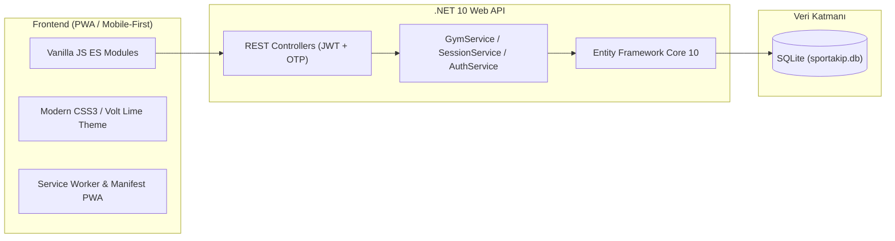

| Katman | Teknoloji | Açıklama |
| :--- | :--- | :--- |
| **Backend** | .NET 10 (C# 13) | ASP.NET Core Web API, katı Nullable Reference Types (`CS8600` temiz) |
| **ORM & Veritabanı** | EF Core 10 + SQLite | Sıfır kurulum gerektiren taşınabilir `sportakip.db` |
| **Kimlik & Güvenlik** | JWT Bearer + SMS/OTP | SHA-256 hash'li OTP doğrulama, RBAC rol denetimi (Admin, Coach, Athlete) |
| **Frontend** | Vanilla JavaScript (ESM) | Ağır JS framework bağımlılığı yok, <100ms ilk yükleme süresi |
| **Tasarım & UI** | CSS3 Custom Properties | Obsidian Dark & Neon Volt renk paleti, 390px mobil sıfır kayma (Zero-Drift) |
| **Mobil Dağıtım** | PWA (Progressive Web App) | iOS Safari ve Android Chrome ana ekrana yüklenebilir yerel uygulama hissiyatı |
| **Test Paketi** | xUnit + EF InMemory / SQLite | **56/56 Birim ve Entegrasyon Testi (%100 Başarı)** |

---

## 🚀 Kurulum ve Yerel Çalıştırma

### Gereksinimler
* [.NET 10 SDK](https://dotnet.microsoft.com/download/dotnet/10.0)

### 1. Projeyi Klonlayın
```bash
git clone https://github.com/mufuks/SporTakip.git
cd SporTakip
```

### 2. Testleri Doğrulayın
```bash
dotnet test
```
*(Tüm 56 birim ve entegrasyon testinin yeşil yandığını doğrulayın)*

### 3. API & Web Arayüzünü Başlatın
```bash
dotnet run --project src/SporTakip.Api
```

### 4. Tarayıcıda Açın
```
http://localhost:5163
```

---

## 👥 Örnek Test Kullanıcıları (Seed Data)

Sistem ilk kez çalıştırıldığında veritabanı örnek verilerle otomatik olarak tohumlanır:

| Rol | Kullanıcı | Telefon Numarası | SMS / OTP Kodu | Açıklama |
| :--- | :--- | :--- | :---: | :--- |
| **Misafir** | Ziyaretçi | *(Oturumsuz)* | - | Genel tanıtım, antrenman şablonları, kilitli takvim |
| **Sporcu** | Meltem Yılmaz | `+90 555 123 45 67` | `123456` | 8 Seans Fonksiyonel Grup paketi, aktif seanslar |
| **Sporcu** | Can Demir | `+90 555 987 65 43` | `123456` | Bireysel PT paketi, bakiye borcu |
| **Koç** | Gülçin | `+90 532 444 55 66` | `123456` | Mod anahtarı, yoklama alma, kişisel hakediş |
| **Salon Sahibi** | Sinan | `+90 532 111 22 33` | `123456` | Ciro, kasa, bordrolar, kadro, paket/fiyat yönetimi |

---

## 📄 Lisans

Bu proje **MIT Lisansı** ile lisanslanmıştır. Detaylar için [LICENSE](LICENSE) dosyasına göz atabilirsiniz.
