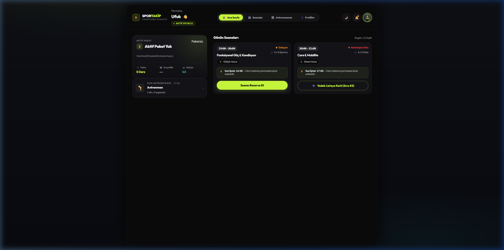

# ⚡ SporTakip | Compound Athletic

> Modern, yüksek performanslı ve rol tabanlı (RBAC) Spor Salonu & Atlet Antrenman Takip Platformu.



---

## 🌟 Genel Bakış

**SporTakip**, butik ve fonksiyonel fitness salonları (Compound Athletic, CrossFit, Pilates, PT stüdyoları) için geliştirilmiş; antrenör, salon yöneticisi ve sporcu deneyimini **tek bir modern, şık ve tutarlı arayüzde** birleştiren yeni nesil bir yönetim sistemidir.

Harici ağır frontend framework'leri yerine, **ultra hafif ve yüksek performanslı Vanilla JS + CSS mimarisi** ve **.NET 10 Web API** ile geliştirilmiştir.

---

## 🚀 Öne Çıkan Özellikler

### 📱 1. Sporcu & Atlet Deneyimi (PWA)
* **Aktif Paket Takibi:** Kalan ders sayısı, son geçerlilik tarihi ve bakiye durumu segmented progress bar ile anlık takip edilir.
* **Seans & Rezervasyon:** Günün ve haftanın seanslarına tek tıkla rezervasyon yapma, kontenjan dolduğunda yedek listeye katılma.
* **Antrenman & PR Takibi (Hevy Tarzı Canlı İdman):** Serbest veya şablon bazlı egzersiz loglama, canlı set kaydı (ağırlık, tekrar, RPE), 1RM rekorları (Squat, Bench Press, Deadlift vb.).
* **Fiziksel Profil & Canlı VKİ:** Boy, kilo, yaş ve cinsiyet takibi ile anlık dinamik **Beden Kitle İndeksi (VKİ)** ve sağlık kategorisi ("Fit / Normal", "Fazla Kilolu", vb.) hesaplama.
* **Sürtünmesiz SMS / OTP Girişi:** Şifre ezberleme zorunluluğu olmadan, telefon numarasına gelen tek kullanımlık 6 haneli kodla anında güvenli giriş.

### 🏋️ 2. Antrenör & Salon Yönetimi (RBAC)
* **Hızlı Yoklama (Flagship Floor Screen):** Salonda antrenman esnasında tek dokunuşla katılım düşme ve kalan dersleri otomatik güncelleme.
* **Canlı Stüdyo Doluluk & Saatlik Kapasite:** Aşırı yoğunluğu önleyen saatlik doluluk şeridi (`● Rahat 0-3`, `● Doluyor 4-5`, `● Kritik Dolu 6+`).
* **Seans Takvimi:** Aylık ve günlük interaktif seans planlama, eğitmen atama.
* **Üyeler & Paket Satışı:** Sporcu listesi, paket geçmişi, borç takibi ve hızlı paket satışı.
* **Kasa & Eğitmen Hakediş Bordrosu (Admin):** Ders başı eğitmen primleri, ikame hoca payları ve salon net karı.

---

## 🛠️ Mimari ve Teknoloji Yığını

| Katman | Teknoloji | Açıklama |
|---|---|---|
| **Backend** | .NET 10 (C# 13) | ASP.NET Core Web API, Minimal API mimarisi |
| **Veritabanı** | EF Core 10 + SQLite | Otomatik seeder, dinamik migrasyon dayanıklılığı |
| **Güvenlik** | JWT + OTP Authentication | Rol tabanlı yetkilendirme (Admin, Coach, Athlete) |
| **Frontend** | Vanilla JS (ES Modules) + CSS3 | Koyu tema (Obsidian & Volt Lime), glassmorphic kartlar |
| **Test** | xUnit + FluentAssertions | 49/49 Birim ve Entegrasyon Testi (%100 Başarı) |

---

## ⚙️ Kurulum & Yerel Geliştirme

### Gereksinimler
* [.NET 10 SDK](https://dotnet.microsoft.com/download)

### Projeyi Başlatma

1. Repoyu klonlayın:
   ```bash
   git clone https://github.com/mufuks/SporTakip.git
   cd SporTakip
   ```

2. Testleri çalıştırın:
   ```bash
   dotnet test
   ```

3. Uygulamayı başlatın:
   ```bash
   dotnet run --project src/SporTakip.Api
   ```

4. Tarayıcınızda açın:
   ```
   http://localhost:5163
   ```

---

## 👥 Varsayılan Test Kullanıcıları (Seed Data)

Veritabanı ilk çalıştırmada otomatik olarak örnek verilerle doldurulur:

| Kullanıcı | Telefon | Rol | Açıklama |
|---|---|---|---|
| **Ufuk Söylemez** | `+90 531 774 16 06` | `Athlete` | Grup 8 Ders paketi, PR kayıtları, fiziksel profil |
| **Ahmet Yılmaz** | `+90 555 111 22 33` | `Admin & Coach` | Salon Sahibi, tüm yönetim sekmelerine erişim |
| **Selin Demir** | `+90 555 222 33 44` | `Coach` | Eğitmen, Hızlı Yoklama ve Seans yönetimi |
| **Geliştirici Master OTP** | - | - | Geliştirme ortamında herhangi bir numara için OTP: `123456` |

---

## 📄 Lisans
Bu proje MIT lisansı ile lisanslanmıştır.
