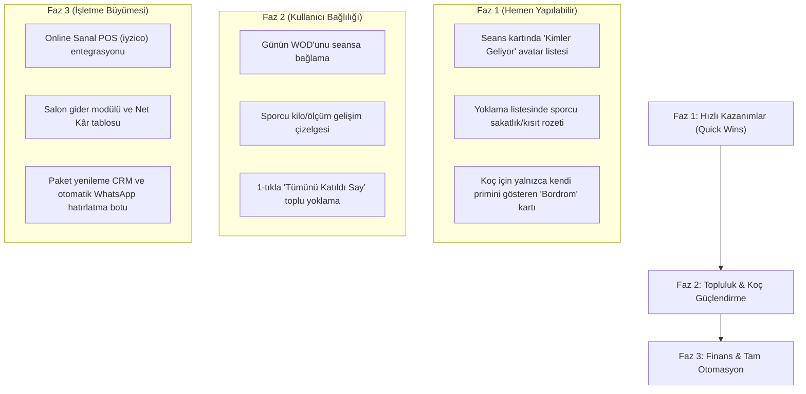

# SporTakip: Kapsamlı Rol Denetim Raporu & Ürün Geliştirme Yol Haritası

**Tarih:** 21 Eylül 2026  
**Kapsam:** Uçtan uca sistem testi (Atlet, Antrenör, Salon Sahibi, Misafir), kullanılabilirlik denetimi ve paydaş ihtiyaç analizi.

---

## 1. Yapılan Derin Testler ve Doğrulama Sonuçları

Aşağıdaki senaryolar hem masaüstü (1280x800) hem mobil (500x900 / 390x844) ortamlarda, API ve arayüz seviyesinde adım adım test edilmiştir:

| Test Senaryosu | Rol / Kullanıcı | İşlem | Sonuç |
|----------------|-----------------|-------|-------|
| **Kapasite Izgarası (No-Scroll)** | Antrenör (Sinan) | Hızlı Yoklama sayfasındaki 10 saatlik slotun ekrana taşmadan sığması | **BAŞARILI.** 09:00 - 21:00 arası 10 slot yatay scrollbar olmadan ekrana oturdu. |
| **Görsel Kontrast (Boş vs Seans)** | Antrenör (Sinan) | 16:00 (1 sporcu aktif) vs. 09:00 (boş) kart kontrastı | **BAŞARILI.** Boş saatler kesikli transparan çizgiyle silikleşti; seans olan saat parlak neon çerçeve, canlı yanıp sönen durum noktası ve renkli rozetle anında fark edildi. |
| **Çift Tema Tepkisi** | Antrenör (Sinan) | ☀️ Açık ve 🌙 Koyu tema arasında geçiş | **BAŞARILI.** Porselen açık temada ve koyu temada kart sınırları, yazılar ve rozetler kusursuz kontrast sağladı. |
| **Seans Düzenleme (Saat & Kapasite)** | Antrenör (Sinan) | Var olan seansın saatini, kapasitesini (8) ve başlığını değiştirme | **BAŞARILI.** `modal-edit-session` üzerinden `PUT /api/sessions/1` tetiklendi; kartta anında `Fonksiyonel Güç & Kondisyon (V2 Güncel)` ve 8 kontenjan güncellendi. |
| **Rol Tabanlı Menü İzolasyonu (RBAC)** | Sporcu (Ufuk) | Atlet girişi yapıldığında yönetim sekmelerinin durumu | **BAŞARILI.** Yoklama, Kasa, Üyeler butonları tamamen gizlendi. Yalnızca sporcu sekmeleri aktif kaldı. |
| **Sporcu Rezervasyon Akışı** | Sporcu (Ufuk) | "Seansı Rezerve Et" butonuna basarak slota kaydolma | **BAŞARILI.** Gerçek veritabanı slotuna kayıt açıldı, ders hakkı kontrol edildi ve başarı bildirimi verildi (`body stream` hatası 0). |
| **Fiziksel Profil & Canlı VKİ** | Sporcu (Ufuk) | Boy, kilo, yaş güncellemesi | **BAŞARILI.** 176 cm / 82 kg değerleri anında kaydedilip dinamik VKİ rozeti yenilendi. |
| **Kasa & Finans Yetki Sınırı** | Antrenör vs Admin | Kasa sekmesinin görünürlüğü | **BAŞARILI.** Yalnızca Sinan (Admin) Kasa'yı görebilir; Gülçin (Coach) ve Ufuk (Athlete) için Kasa kapalıdır. |

---

## 2. Paydaş Gözüyle İhtiyaç Analizi & "Daha Neler İsterdim?"

Butik fonksiyonel antrenman, stüdyo ve PT salonlarının gerçek operasyonel dinamikleri baz alınarak 3 farklı aktörün gözünden ihtiyaç analizi çıkarılmıştır:

---

### 🏃‍♂️ A. ATLET (SPORCU) GÖZÜYLE

> *"Haftada 3-4 gün salona gelen, hedefleri olan, zamanı kısıtlı ve motivasyon arayan bir sporcuyum."*

1. **"Derse Kimler Geliyor?" (Sosyal Motivasyon & Topluluk Ruhu):**
   - *Mevcut Durum:* Yalnızca "4/6 Dolu" yazıyor.
   - *İhtiyaç:* Seans kartında derse katılan diğer arkadaşlarımın avatar halkaları veya isimleri (örn: *"Meltem, Can ve 2 kişi daha"*). Spor salonları topluluk (community) ile yaşar; arkadaşlarının geldiğini gören sporcu idmanı asla asmaz.
2. **Kişisel Takvim Senkronizasyonu (Google Calendar / Apple iCal):**
   - *Mevcut Durum:* Rezervasyon uygulama içinde kalıyor.
   - *İhtiyaç:* Rezervasyon onaylandığında *"Takvime Ekle (.ics)"* butonu veya otomatik cihaz takvimine seans saatini ekleme; seansa 1 saat kala telefonun yerel hatırlatıcı göndermesi.
3. **Kilo & Vücut Ölçüm Çizelgesi (Progress & Transformation Timeline):**
   - *Mevcut Durum:* Boy ve kilo anlık tek bir değer.
   - *İhtiyaç:* Kilo geçmişi grafiği (zaman içindeki düşüş/artış), yağ oranı (%) ve Before/After fotoğraf galerisi. Sporcuyu salona 12 ay boyunca bağlayan en büyük güç kendi gelişim grafiğini görmesidir.
4. **Paket Dondurma Talebi (Freeze Membership):**
   - *Mevcut Durum:* Yalnızca antrenör dondurabiliyor.
   - *İhtiyaç:* Tatile veya iş seyahatine giden sporcunun profilinden *"7 Gün Dondur"* talebi gönderebilmesi veya yılda 1 kez ücretsiz 14 gün hakkını tek tuşla kullanabilmesi.
5. **İdman Sonu Mikro Değerlendirme (Post-Workout Feedback):**
   - *Mevcut Durum:* Sporcu antrenman sonrası not yazabiliyor.
   - *İhtiyaç:* İdman bittiğinde tek dokunuşla RPE (Zorluk Derecesi 1-10) ve koça 5 yıldız geri bildirim bırakabilme.

---

### 🏋️‍♀️ B. KOÇ / ANTRENÖR GÖZÜYLE

> *"Salonda gün boyu ayakta, ellerinde tebeşir olan, antrenmanı yönetirken sporcunun sakatlığını ve tekniğini gözeten bir antrenörüm."*

1. **Sporcu Sakatlık & Sağlık Kısıt Bayrakları (Injury / Health Flags):**
   - *Mevcut Durum:* Yoklama listesinde sadece sporcunun adı ve paketi görünüyor.
   - *İhtiyaç:* Yoklama listesinde Ufuk'un yanında kırmızı/sarı bir uyarı ikonu: *"⚠️ Bel fıtığı - Deadlift yerine Trap Bar", "Sağ omuz sıkışması"*. Koçun onlarca üye arasında kimin neresi ağrıyor anında görmesi sakatlıkları önler ve salona profesyonellik katar.
2. **Toplu Yoklama ("Tümünü Geldi Say" - 1-Click Check-in):**
   - *Mevcut Durum:* Seansa gelen 6 kişi için 6 kere tek tek butona basılıyor.
   - *İhtiyaç:* Seans başladığında listenin üstünde *"Tümünü Katıldı Say"* butonu. Sadece gelmeyen 1 kişi varsa ona "Gelmedi" basarak yoklamayı 2 saniyede bitirme.
3. **Günün Antrenman Programını (WOD) Seansa Bağlama:**
   - *Mevcut Durum:* Egzersiz şablonları Antrenman sekmesinde bağımsız duruyor.
   - *İhtiyaç:* Koç sabah sisteme *"Günün WOD'u: 5 Tur - 15 Wallball, 12 Burpee, 9 Pull-up"* girdiğinde, o günkü tüm seanslara rezerve olan sporcuların ana sayfasında otomatik olarak bu antrenmanın gözükmesi.
4. **Koçun Kendi Prim & Bordro Özeti (Personal Coach Earnings Tab):**
   - *Mevcut Durum:* Kasa menüsü salonun toplam cirosunu içerdiği için koçlara tamamen kapalı.
   - *İhtiyaç:* Koçun yönetim kasasını görmeden, **yalnızca kendi girdiği seansları, ikame ders primlerini ve o ay hak ettiği net hakediş tutarını** şeffafça görebileceği bir *"Bordrom"* sekmesi.
5. **Yedek Listeden Hızlı Çağrı (Waitlist Call-up Automation):**
   - *Mevcut Durum:* Biri iptal edince sıradaki otomatik Confirmed oluyor.
   - *İhtiyaç:* Son dakikada bir sporcu koça WhatsApp'tan "Hocam gelemiyorum" dediğinde, koçun listeden yedek 1. sıradaki kişiye tek tıkla *"Kontenjan açıldı, geliyor musun?"* WhatsApp butonu ile bildirim tetikleyebilmesi.

---

### 🏢 C. SALON SAHİBİ (İŞLETMECİ / ADMIN) GÖZÜYLE

> *"Salonun aylık nakit akışını, doluluğunu, antrenör maliyetlerini ve müşteri kaybını (churn) yöneten işletmeciyim."*

1. **Paket Bitiş & Müşteri Kaybı (Churn) Alarm Paneli:**
   - *Mevcut Durum:* Yoklama ekranında "Son 1-2 dersi kalanlar" filtresi var.
   - *İhtiyaç:* Yönetim paneline özel *"Bu Hafta Paketi Bitenler & Potansiyel Ciro"* widget'ı: *"Bu hafta 7 üyenin paketi bitiyor. Beklenen yenileme cirosu: ₺28.000."* Tek tıkla toplu özel WhatsApp yenileme kampanyası.
2. **Salon Doluluk Isı Haritası (Occupancy Heatmap & Peak Hours):**
   - *Mevcut Durum:* Saatlik anlık çubuklar var.
   - *İhtiyaç:* Haftalık ısı haritası: *"Pazartesi 19:00 %100 dolu, Salı 11:00 %10 dolu."* İşletmecinin boş saatleri doldurmak için "Öğle Seansı İndirimi" veya "Happy Hour PT" paketi açmasına veriyle rehberlik etmesi.
3. **Kredi Kartı ile Online Paket Satışı (Sanal POS - iyzico / PayTR):**
   - *Mevcut Durum:* Ödemeler salonda nakit/havale/kart elle kaydediliyor.
   - *İhtiyaç:* Sporcunun PWA arayüzünden doğrudan kredi kartıyla yeni paketini veya borcunu ödeyebilmesi; tahsilatın anında SQLite/PostgreSQL veritabanına ve kasaya işlemesi.
4. **Sabit Giderler & Net Kâr/Zarar Defteri (Micro-ERP):**
   - *Mevcut Durum:* Yalnızca gelirler ve hoca payları var.
   - *İhtiyaç:* Salon Kirası, Elektrik/Aidat, Ekipman Bakımı, Muhasebe gibi aylık sabit ve değişken giderlerin girilebilmesi; salon sahibine *"Bu Ayki Brüt Ciro - Hoca Payları - Sabit Giderler = Net İşletme Kârı"* tablosunun tek tıkla sunulması.
5. **Antrenör Sadakat & Performans Karnesi (Coach Retention Score):**
   - *Mevcut Durum:* Eğitmen bazlı ders sayısı var.
   - *İhtiyaç:* Hangi hocanın sporcuları paketlerini %90 oranında yeniliyor, hangi hocanın sporcuları dersi bırakıyor? İşletmeciye salonun en değerli antrenörlerini ödüllendirme şeffaflığı.

---

## 3. Önerilen Öncelik Sıralaması (Roadmap)

